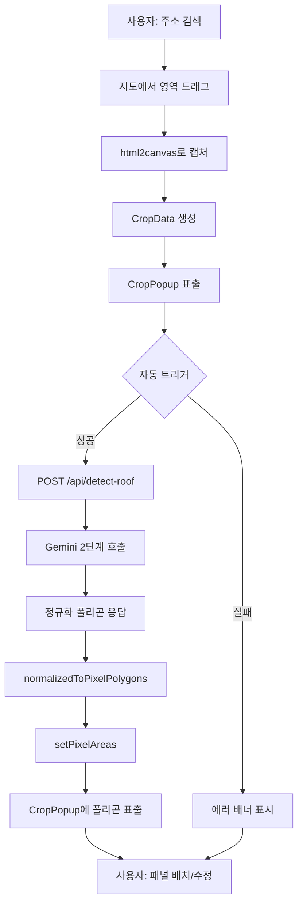
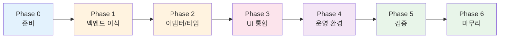
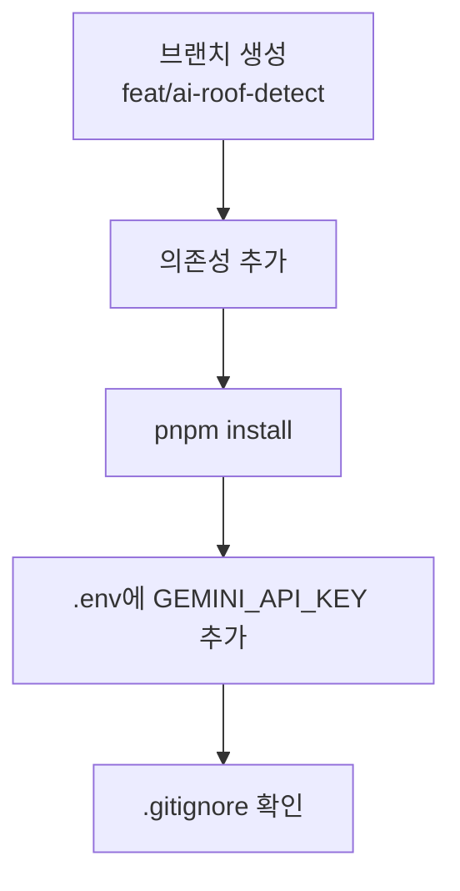
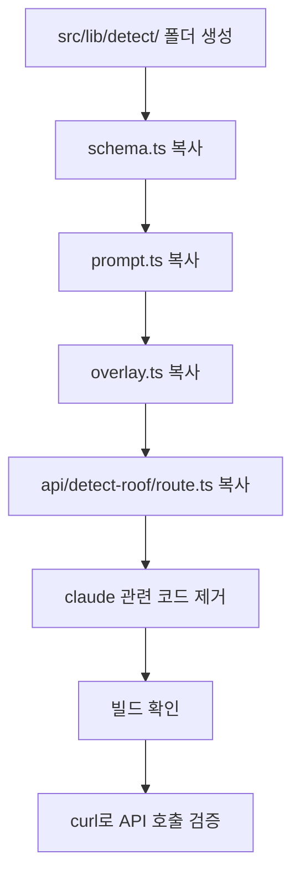
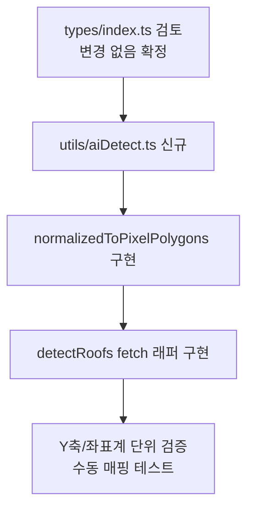
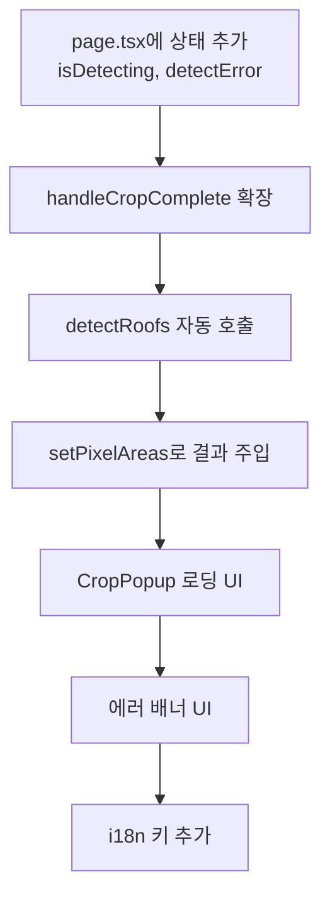
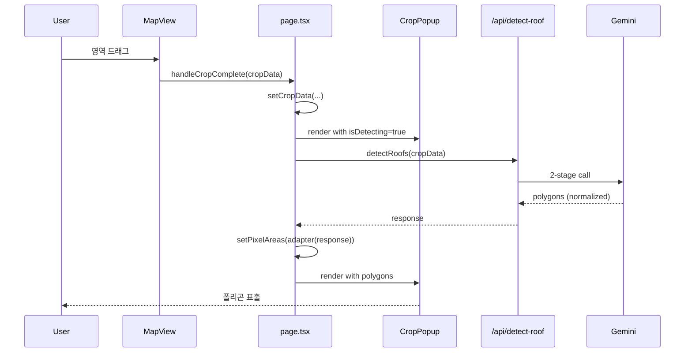
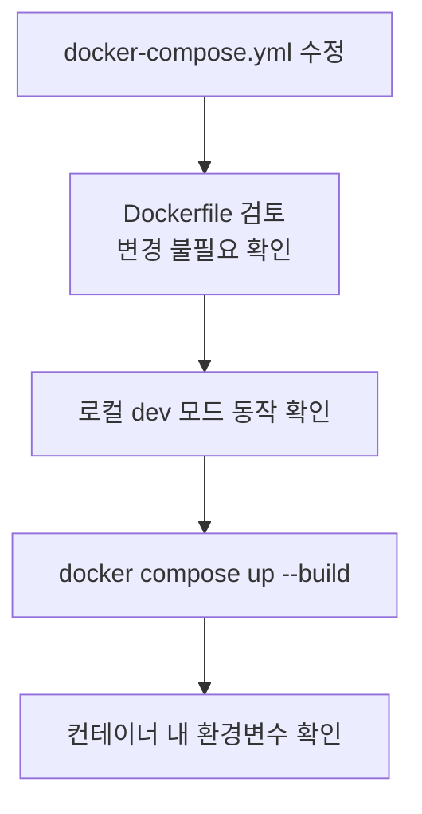
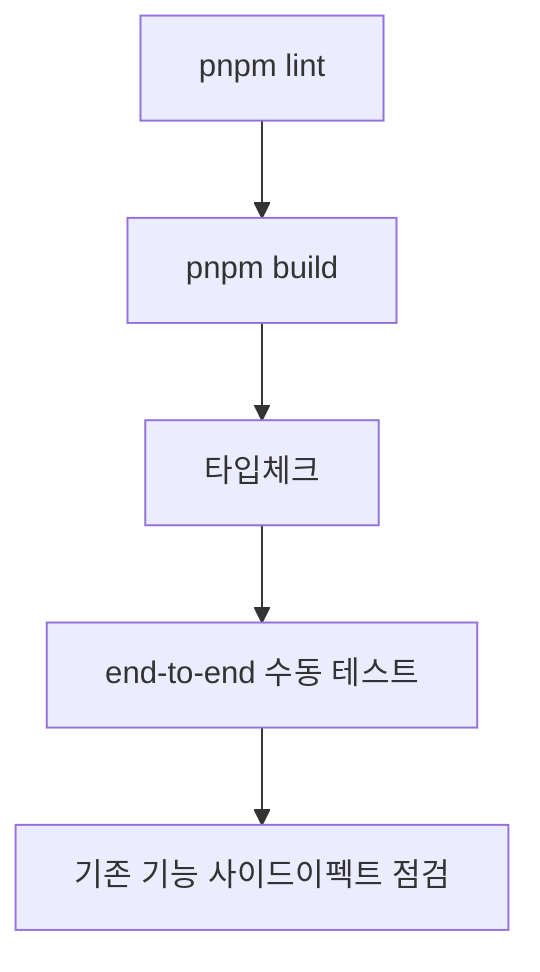
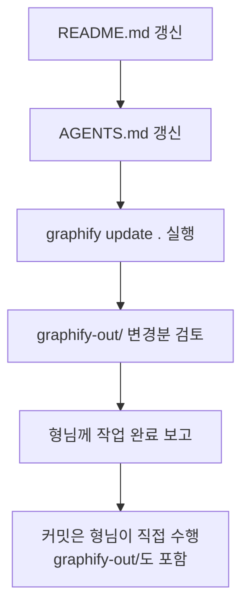

# solar-precision의 AI 지붕 감지 기능 이식 계획

> **소스 레포**: `../../../solar-precision/`
> **타겟 레포**: solar-pv-system (이 레포)
> **목표**: 사용자가 영역을 크롭하면 Gemini가 자동으로 지붕면 폴리곤을 감지하여 CropPopup에 표출

---

## 1. 개요

solar-precision은 위성 이미지로부터 Gemini Vision으로 지붕면을 자동 감지하는 앱이다.
solar-pv-system은 사용자가 수동으로 지붕 폴리곤을 그려 패널을 배치하는 앱이다.

본 계획은 solar-precision의 **AI 감지 백엔드**를 그대로 이식하고, solar-pv-system의 **크롭 → 폴리곤 → 패널 배치** 워크플로우에 자동 감지 단계를 끼워넣는 작업이다.

### 핵심 인사이트

두 앱의 데이터 형태가 호환된다:
- solar-precision API 입력: `{ imageDataUrl, bounds:{sw,ne} }`
- solar-pv-system `CropData`: 동일 구조 (`src/app/types/index.ts:36`)

→ 백엔드는 거의 복사, 클라이언트는 좌표 어댑터 한 곳만 추가하면 통합 가능.

---

## 2. 의사결정 매트릭스 (확정)

| # | 결정 | 확정 내용 |
|---|------|---------|
| D1 | AI 모델 | **Gemini만**. Claude 라우트/SDK/키 전부 제외 |
| D2 | 트리거 | **크롭 직후 자동 실행**. 별도 버튼 없음 |
| D3 | 폴리곤 충돌 | 자동 해소 (D2 결정으로 충돌 시나리오 자체가 없음) |
| D4 | azimuth/tilt 활용 | **완전 무시**. API는 받지만 클라에서 `points`만 사용. PixelPolygon 타입 변경 없음 |
| D5 | API 키 관리 | **`.env` + docker-compose `environment:`**. 기존 Google Maps 키 방식과 동일 패턴 |
| D6 | 에러 처리 | **에러 메시지 표시만**. 폴백/재시도 없음 |
| D7 | graphify | **`graphify update .` (AST-only) 자동 실행** (PL 답변 반영, a7e8fd2 머지 + docs/graphify-setup.md L141-144 정책). `graphify-out/` 변경분 커밋 포함. **풀 빌드(`/graphify --update`)는 본 plan 범위 외 — 문서/이미지 변경 시 또는 PR 머지 시점에 형님이 명시적으로 실행** (graphify-setup.md L171) |

---

## 3. 전체 워크플로우 다이어그램

---

## 4. 작업 Phase 개요

| Phase | 예상시간 | 검토 체크포인트 |
|-------|---------|-----------|
| 0. 준비 | 15분 | 의존성 설치 확인 |
| 1. 백엔드 이식 | 1시간 | curl로 API 응답 검증 |
| 2. 어댑터/타입 | 1시간 | 단위 검증 (normalized→pixel 매핑) |
| 3. UI 통합 | 1.5~2시간 | end-to-end 동작 |
| 4. 운영 환경 | 30분 | docker compose up 동작 |
| 5. 검증 | 30분 | lint/build/type 통과 |
| 6. 마무리 | 15분 | docs 갱신, graphify update |

**총 예상**: ~5시간

---

## 5. Phase 0 — 준비

| # | 태스크 | 명령/위치 | 검증 |
|---|------|---------|------|
| 0.1 | 브랜치 생성 | `git checkout -b feat/ai-roof-detect` | `git branch` |
| 0.2 | 의존성 추가 | `pnpm add @google/genai@^1.0.0 sharp@^0.34.5 zod@^4.3.6` (solar-precision 버전 매칭) | `package.json` 확인 |
| 0.2b | 빌드 승인 (package.json) | `pnpm.onlyBuiltDependencies: ["sharp", "unrs-resolver"]` 블록 추가 (solar-precision 패턴) | jq 또는 grep 확인 |
| 0.2c | 빌드 승인 (pnpm-workspace.yaml 신규) | `allowBuilds: { sharp: true, unrs-resolver: true }` 작성 (solar-precision 패턴) | 파일 존재 확인 |
| 0.3 | 설치 + 빌드스크립트 재실행 | `pnpm install` | sharp 네이티브 바이너리(libvips) 컴파일 완료, "Ignored build scripts" 경고 사라짐 |
| 0.4 | 키 등록 | 기존 `.env`에 `GEMINI_API_KEY=AIza...` 한 줄 추가 (`.env.local` 신규 생성 X — 환경 분리 안 함) | `grep GEMINI_API_KEY .env` |
| 0.5 | gitignore | `.gitignore` L37-38이 `.env*` 와일드카드로 이미 모든 env 파일 무시. 추가 작업 없음 | 확인만 |

**의사결정 없음.**

---

## 6. Phase 1 — 백엔드 이식 (거의 그대로 복사)

| # | 태스크 | 소스 → 타겟 | 변경 |
|---|------|---------|------|
| 1.1 | 폴더 생성 | — → `src/lib/detect/` | mkdir |
| 1.2 | 스키마 | `../solar-precision/src/lib/detect/schema.ts` → `src/lib/detect/schema.ts` | 그대로 복사 |
| 1.3 | 프롬프트 | `prompt.ts` → 동일 | 그대로 복사 |
| 1.4 | 오버레이 | `overlay.ts` → 동일 | 그대로 복사 |
| 1.5 | Gemini 라우트 | `src/app/api/detect-roof/route.ts` → 동일 경로 | 그대로 복사 |
| 1.6 | **Claude 제외** | `claude.ts`, `api/detect-roof-claude/` | **이식 안 함 (D1)** |
| 1.7 | `mapGeometry.ts` 처리 | — | **이식 안 함** (클라 전용 google.maps 의존, pv-system에선 불필요) |
| 1.8 | path alias 확인 | `tsconfig.json`의 `@/*` 매핑 일치 | tsc 통과 |
| 1.9 | 빌드 확인 | `pnpm build` | 컴파일 에러 0 |
| 1.10 | API 동작 검증 | curl로 작은 PNG dataUrl + 더미 bounds 호출 | 200 응답 + 폴리곤 배열 |

**체크포인트**: UI 변경 0. API만 살아있으면 통과.

---

## 7. Phase 2 — 좌표 어댑터 + 타입 (코어)

| # | 태스크 | 위치 | 핵심 로직 |
|---|------|------|--------|
| 2.1 | 타입 변경 | `src/app/types/index.ts` | **변경 없음 (D4)**. PixelPolygon 그대로 |
| 2.2 | 어댑터 파일 신규 | `src/app/utils/aiDetect.ts` | mkfile |
| 2.3 | 좌표 변환 함수 | `normalizedToPixelPolygons(response, canvasW, canvasH)` | `x_px = x * W; y_px = y * H`. label/azimuth/tilt/confidence는 **버림** |
| 2.4 | fetch 래퍼 | `detectRoofs(cropData): Promise<PixelPolygon[]>` | POST `/api/detect-roof` → adapter |
| 2.5 | 좌표계 검증 | 정규화 [0.5, 0.5] → 캔버스 중앙 픽셀이 나오는지 수동 확인 | 콘솔 로그 |

### ⚠️ 리스크 R2 핵심 위치

`canvasW`/`canvasH`로 무엇을 쓸지가 가장 중요한 결정이다:
- **CropPopup이 화면에 표시하는 캔버스 크기** vs **원본 이미지의 naturalWidth/Height**
- AI는 서버에 보낸 이미지의 픽셀 좌표를 [0..1]로 정규화해서 응답함
- → 변환 시 **서버로 보낸 이미지의 W/H** 를 사용해야 함 (즉 cropData.imageDataUrl의 naturalSize)

**검증 방법**: 폴리곤이 캔버스에 그려지는 위치가 위성 이미지의 지붕 위에 정확히 떨어지는지 시각 확인.

---

## 8. Phase 3 — UI 통합 (자동 트리거)

| # | 태스크 | 파일 | 변경 내용 |
|---|------|------|---------|
| 3.1 | 상태 추가 | `src/app/page.tsx` | `isDetecting`, `detectError` useState |
| 3.2 | 자동 트리거 | `handleCropComplete` 콜백 확장 | `setCropData` 직후 `detectRoofs` 호출 |
| 3.3 | 결과 주입 | 동일 | 응답 → `setPixelAreas({areas, metersPerPixel})` |
| 3.4 | 로딩 UI | `src/app/components/CropPopup.tsx` | `isDetecting`이면 반투명 오버레이 + 스피너 |
| 3.5 | 에러 UI | `page.tsx` 또는 `CropPopup` | `detectError`가 있으면 배너 표시 (D6: 표시만, 폴백 없음) |
| 3.6 | i18n | `src/app/utils/i18n.ts` | `aiDetecting`, `aiDetectFailed` 키 추가 (ja/en) |

### 자동 트리거 흐름

**검증**: 실제 일본 주택 좌표 1~2곳에서 크롭 → 자동 감지 → 폴리곤 표출까지 모두 동작.

---

## 9. Phase 4 — 운영 환경

| # | 태스크 | 위치 | 변경 내용 |
|---|------|------|--------|
| 4.1 | compose 환경변수 | `docker-compose.yml` | `environment:` 섹션에 `GEMINI_API_KEY=${GEMINI_API_KEY}` 한 줄 추가 |
| 4.2 | Dockerfile | `Dockerfile` | **변경 없음** (런타임 env, 빌드 단계 무관) |
| 4.3 | dev 검증 | `pnpm dev` | API 호출 성공 |
| 4.4 | 프로덕션 빌드 | `docker compose up --build` | 컨테이너 정상 시작 |
| 4.5 | env 확인 | `docker exec <container> env \| grep GEMINI_API_KEY` | 키 노출 확인 (단, **공개 서버에선 SSH 접근자=키 접근자임을 인지**) |

---

## 10. Phase 5 — 검증

| # | 태스크 | 명령 | 통과 기준 |
|---|------|------|--------|
| 5.1 | 린트 | `pnpm lint` | 오류 0. 경고는 가능한 모두 해결 |
| 5.2 | 빌드 | `pnpm build` | 성공 |
| 5.3 | 타입체크 | tsc | 오류 0 |
| 5.4 | end-to-end | 수동 | 일본 주택 1~2곳에서 감지 → 배치 → 저장 |
| 5.5 | 사이드이펙트 | 수동 | 기존 수동 그리기, 패널 배치, 시뮬레이션 입력 모두 정상 동작 |

### 사이드이펙트 체크리스트 (룰 #6)

- [ ] `handleCropComplete` 시그니처 변경 → 호출부 모두 일치
- [ ] `handleCropClose`가 detectError도 초기화하는지
- [ ] `pixelAreas` 상태가 기존 흐름과 충돌 없는지
- [ ] AI 호출 중 사용자가 CropPopup 닫으면 race condition 없는지

---

## 11. Phase 6 — 마무리

| # | 태스크 | 위치 | 변경 내용 |
|---|------|------|--------|
| 6.1 | README | `README.md` | AI 감지 기능, `GEMINI_API_KEY` 환경변수 가이드 추가 |
| 6.2 | AGENTS.md | `AGENTS.md` | `Environment Variables` 표에 `GEMINI_API_KEY` 추가. `Tech Stack` 또는 의존성 명시부에 `@google/genai`, `sharp`, `zod` 추가 |
| 6.2b | CLAUDE.md | `CLAUDE.md` | 현재 `@AGENTS.md` 한 줄만 가리킴 → **변경 불필요** |
| 6.3 | graphify | — | **`graphify update .` 실행** (AGENTS.md `graphify` 섹션 룰, a7e8fd2 이후 자동 실행 정책). `graphify-out/` 변경분도 git 트래킹 대상 |
| 6.4 | 커밋 | — | **형님이 직접 수행. AI는 절대 `git add` / `git commit` 실행 안 함.** AGENTS.md "의미있는 한 문장 단위 커밋" 룰은 형님이 적용. `graphify-out/` 변경분도 마지막 커밋에 포함 |

---

## 12. 리스크 관리

| # | 리스크 | 발생 위치 | 대응 |
|---|------|---------|------|
| **R1** | Y축/좌표계 혼동 | Phase 2.5 | 단위 매핑 검증으로 확인 |
| **R2** | 캔버스 W/H vs 원본 이미지 W/H 매핑 오류 | Phase 2.3 | `cropData.imageDataUrl`의 naturalSize를 변환 기준으로 명시 사용. 시각 검증 |
| **R3** | 이미지 크기 한도 (5MB / 25M px) | Phase 1 (서버 라우트 내장) | 크롭 영역 최대 크기 제한 또는 사전 압축 |
| **R5** | Gemini 502/타임아웃 | Phase 3.5 | D6 = 에러 표시만. 폴백 없음 |
| **R8** | API 키 노출 | Phase 4.1 | `NEXT_PUBLIC_` 접두사 절대 금지. 서버 라우트 전용. `.env` git 제외 |
| **R6** | React Compiler stale closure | Phase 3.2 | useCallback 의존성 명시 |
| **R7** | `handleCropClose` 부수효과 | Phase 5.5 | isDetecting 중 닫기 시 race 처리 |
| **R10** | God Node 4개 동시 수정 | Phase 3 전체 | graphify-out/GRAPH_REPORT.md에 따르면 이식 작업이 4개 God Node(`Home`, `CropPopup`, `page.tsx`, `t`)를 동시에 건드림. `graphify path "<A>" "<B>"` 또는 `graphify explain "<concept>"`로 영향 노드 확인 후 진행. 사이드이펙트 점검 강화 (룰 #6) |

---

## 12.5 코드 검색 정책 (PreToolUse hook 반영)

`.codex/hooks.json`의 PreToolUse hook이 `grep`/`rg`/`find`/`fd`/`ack`/`ag` 명령 실행 시 graphify 가이드 메시지를 출력함. 본 plan 실행 중 코드 탐색은 다음 우선순위로:

| 우선순위 | 방법 | 사용 시점 |
|---------|------|---------|
| 1순위 | `graphify query "<question>"` / `graphify path "<A>" "<B>"` / `graphify explain "<concept>"` | 아키텍처/관계/cross-module 질문 |
| 2순위 | `graphify-out/GRAPH_REPORT.md` 직접 참조 | god nodes / community 구조 파악 |
| 3순위 | `grep` / `rg` | 그래프에 아직 반영 안 된 변경 코드, 정확한 문자열 매칭 필요 시 |

---

## 13. 별도 보안 트랙 (이식 범위 외, 참고용)

이식 작업과 분리하지만, 운영 직전 같이 검토할 항목:

| 항목 | 권고 |
|------|------|
| Next.js 패치 | `pnpm update next@latest` — 2026년 5월 보안 릴리즈 (13개 CVE) 반영 |
| `.env` 파일 권한 | 서버에서 `chmod 600 .env` |
| Gemini 키 제한 | Google AI Studio에서 IP 화이트리스트 + 사용량 한도 |
| Rate limiting | `/api/detect-roof`에 IP당 호출 제한 (비용 보호) |
| HTTPS | 공개 도메인이면 TLS reverse proxy 필수 |
| 로그 안전 | 에러 로그에 헤더/env 노출 금지 |

---

## 14. 의사결정이 끝났다는 것의 의미

D1~D7 모두 확정되었기 때문에 이 plan은 **추가 의사결정 없이 순차 실행 가능**하다.
실행 도중 새 의사결정이 발생하면 즉시 형님께 보고하고 답을 받은 뒤 진행한다.

---

## 15. 시작 신호

형님의 "ㄱㄱ" 명령 시 Phase 0부터 순차 실행.
각 Phase 종료 시점에 자동으로 검증 결과를 보고하고, **Phase 1 / Phase 3 종료 후에는 중간 검토를 위해 형님 확인을 기다린다**.
