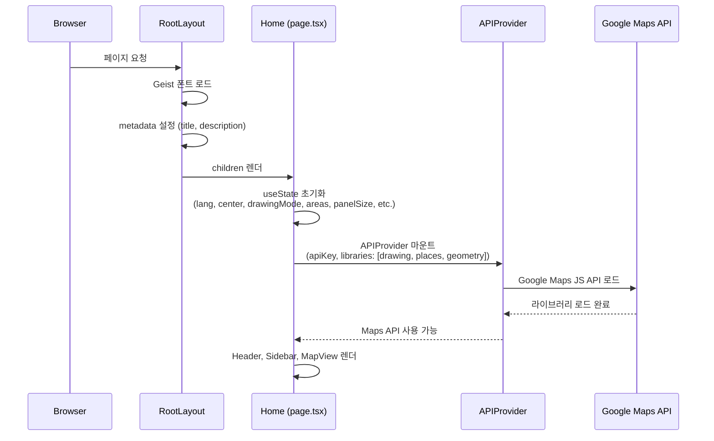
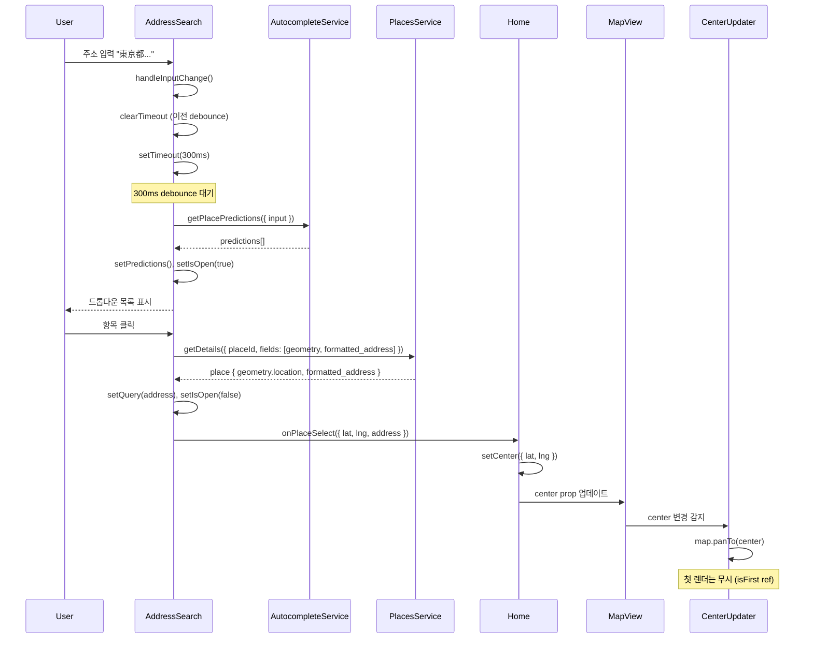
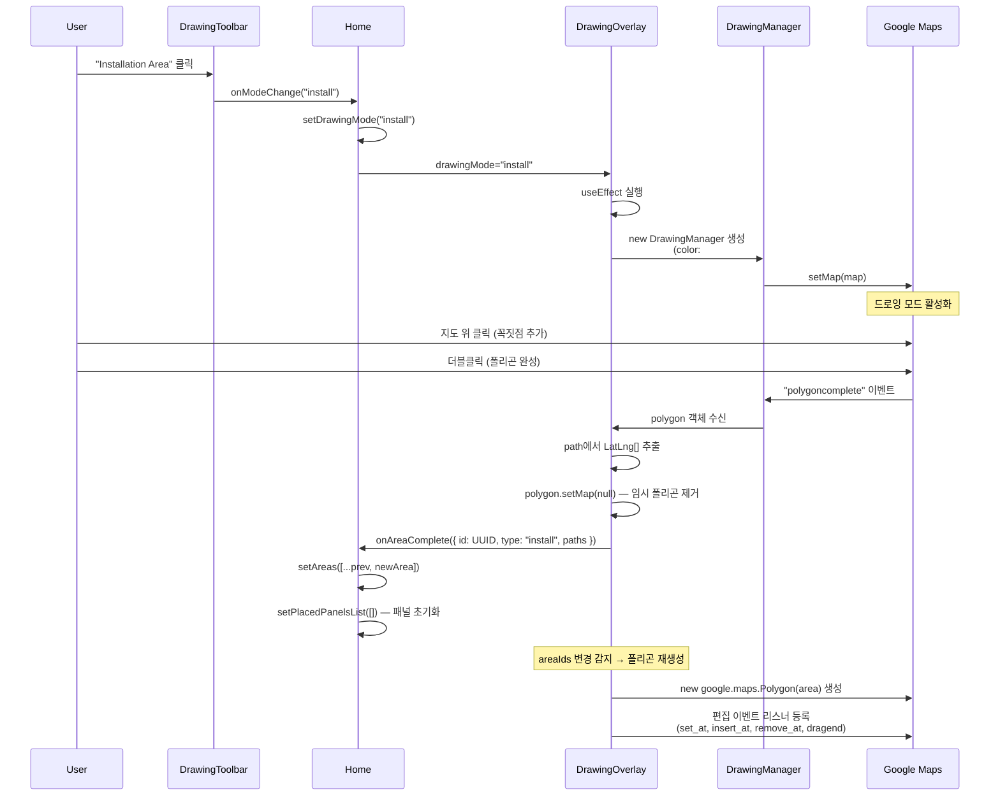
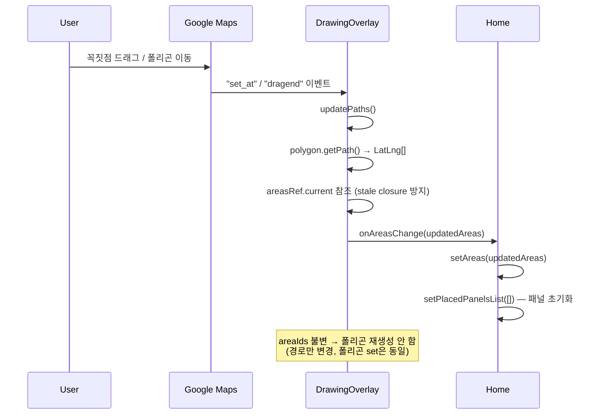
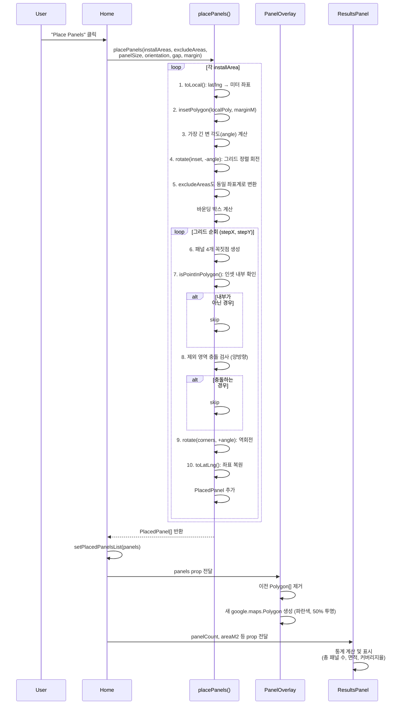
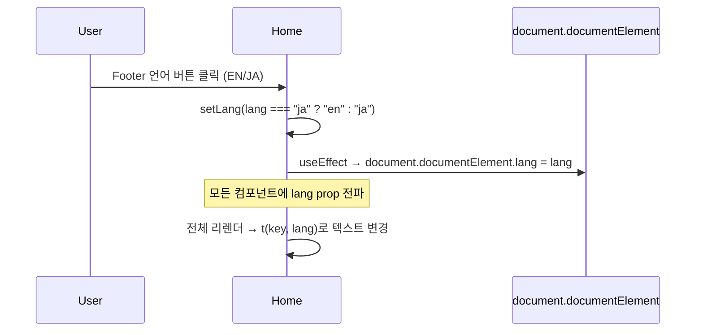
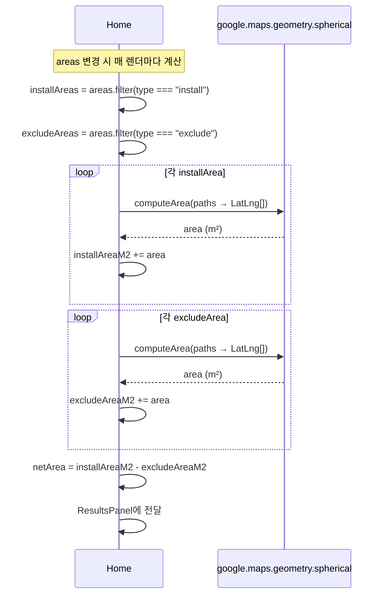

# Solar PV Planner — 시퀀스 다이어그램

## 1. 앱 초기화 시퀀스

```mermaid
sequenceDiagram
    participant B as Browser
    participant L as RootLayout
    participant H as Home (page.tsx)
    participant API as APIProvider
    participant GM as Google Maps API

    B->>L: 페이지 요청
    L->>L: Geist 폰트 로드
    L->>L: metadata 설정 (title, description)
    L->>H: children 렌더
    H->>H: useState 초기화<br/>(lang, center, drawingMode, areas, panelSize, etc.)
    H->>API: APIProvider 마운트<br/>(apiKey, libraries: [drawing, places, geometry])
    API->>GM: Google Maps JS API 로드
    GM-->>API: 라이브러리 로드 완료
    API-->>H: Maps API 사용 가능
    H->>H: Header, Sidebar, MapView 렌더
```

## 2. 주소 검색 시퀀스

```mermaid
sequenceDiagram
    participant U as User
    participant AS as AddressSearch
    participant AC as AutocompleteService
    participant PS as PlacesService
    participant H as Home
    participant M as MapView
    participant CU as CenterUpdater

    U->>AS: 주소 입력 "東京都..."
    AS->>AS: handleInputChange()
    AS->>AS: clearTimeout (이전 debounce)
    AS->>AS: setTimeout(300ms)
    Note over AS: 300ms debounce 대기
    AS->>AC: getPlacePredictions({ input })
    AC-->>AS: predictions[]
    AS->>AS: setPredictions(), setIsOpen(true)
    AS-->>U: 드롭다운 목록 표시

    U->>AS: 항목 클릭
    AS->>PS: getDetails({ placeId, fields: [geometry, formatted_address] })
    PS-->>AS: place { geometry.location, formatted_address }
    AS->>AS: setQuery(address), setIsOpen(false)
    AS->>H: onPlaceSelect({ lat, lng, address })
    H->>H: setCenter({ lat, lng })
    H->>M: center prop 업데이트
    M->>CU: center 변경 감지
    CU->>CU: map.panTo(center)
    Note over CU: 첫 렌더는 무시 (isFirst ref)
```

## 3. 폴리곤 드로잉 시퀀스

```mermaid
sequenceDiagram
    participant U as User
    participant DT as DrawingToolbar
    participant H as Home
    participant DO as DrawingOverlay
    participant DM as DrawingManager
    participant GM as Google Maps

    U->>DT: "Installation Area" 클릭
    DT->>H: onModeChange("install")
    H->>H: setDrawingMode("install")
    H->>DO: drawingMode="install"

    DO->>DO: useEffect 실행
    DO->>DM: new DrawingManager 생성<br/>(color: #0693E3, editable, draggable)
    DM->>GM: setMap(map)
    Note over GM: 드로잉 모드 활성화

    U->>GM: 지도 위 클릭 (꼭짓점 추가)
    U->>GM: 더블클릭 (폴리곤 완성)
    GM->>DM: "polygoncomplete" 이벤트
    DM->>DO: polygon 객체 수신
    DO->>DO: path에서 LatLng[] 추출
    DO->>DO: polygon.setMap(null) — 임시 폴리곤 제거
    DO->>H: onAreaComplete({ id: UUID, type: "install", paths })
    H->>H: setAreas([...prev, newArea])
    H->>H: setPlacedPanelsList([]) — 패널 초기화

    Note over DO: areaIds 변경 감지 → 폴리곤 재생성
    DO->>GM: new google.maps.Polygon(area) 생성
    DO->>GM: 편집 이벤트 리스너 등록<br/>(set_at, insert_at, remove_at, dragend)
```

## 4. 폴리곤 편집 시퀀스

```mermaid
sequenceDiagram
    participant U as User
    participant GM as Google Maps
    participant DO as DrawingOverlay
    participant H as Home

    U->>GM: 꼭짓점 드래그 / 폴리곤 이동
    GM->>DO: "set_at" / "dragend" 이벤트
    DO->>DO: updatePaths()
    DO->>DO: polygon.getPath() → LatLng[]
    DO->>DO: areasRef.current 참조 (stale closure 방지)
    DO->>H: onAreasChange(updatedAreas)
    H->>H: setAreas(updatedAreas)
    H->>H: setPlacedPanelsList([]) — 패널 초기화
    Note over DO: areaIds 불변 → 폴리곤 재생성 안 함<br/>(경로만 변경, 폴리곤 set은 동일)
```

## 5. 패널 배치 계산 시퀀스

```mermaid
sequenceDiagram
    participant U as User
    participant H as Home
    participant PP as placePanels()
    participant PO as PanelOverlay
    participant RP as ResultsPanel

    U->>H: "Place Panels" 클릭
    H->>PP: placePanels(installAreas, excludeAreas,<br/>panelSize, orientation, gap, margin)

    loop 각 installArea
        PP->>PP: 1. toLocal(): lat/lng → 미터 좌표
        PP->>PP: 2. insetPolygon(localPoly, marginM)
        PP->>PP: 3. 가장 긴 변 각도(angle) 계산
        PP->>PP: 4. rotate(inset, -angle): 그리드 정렬 회전
        PP->>PP: 5. excludeAreas도 동일 좌표계로 변환

        PP->>PP: 바운딩 박스 계산
        loop 그리드 순회 (stepX, stepY)
            PP->>PP: 6. 패널 4개 꼭짓점 생성
            PP->>PP: 7. isPointInPolygon(): 인셋 내부 확인
            alt 내부가 아닌 경우
                PP->>PP: skip
            end
            PP->>PP: 8. 제외 영역 충돌 검사 (양방향)
            alt 충돌하는 경우
                PP->>PP: skip
            end
            PP->>PP: 9. rotate(corners, +angle): 역회전
            PP->>PP: 10. toLatLng(): 좌표 복원
            PP->>PP: PlacedPanel 추가
        end
    end

    PP-->>H: PlacedPanel[] 반환
    H->>H: setPlacedPanelsList(panels)
    H->>PO: panels prop 전달
    PO->>PO: 이전 Polygon[] 제거
    PO->>PO: 새 google.maps.Polygon 생성 (파란색, 50% 투명)
    H->>RP: panelCount, areaM2 등 prop 전달
    RP->>RP: 통계 계산 및 표시<br/>(총 패널 수, 면적, 커버리지율)
```

## 6. i18n 언어 전환 시퀀스

```mermaid
sequenceDiagram
    participant U as User
    participant H as Home
    participant DOM as document.documentElement

    U->>H: Footer 언어 버튼 클릭 (EN/JA)
    H->>H: setLang(lang === "ja" ? "en" : "ja")
    H->>DOM: useEffect → document.documentElement.lang = lang
    Note over H: 모든 컴포넌트에 lang prop 전파
    H->>H: 전체 리렌더 → t(key, lang)로 텍스트 변경
```

## 7. 면적 계산 시퀀스

```mermaid
sequenceDiagram
    participant H as Home
    participant GEO as google.maps.geometry.spherical

    Note over H: areas 변경 시 매 렌더마다 계산

    H->>H: installAreas = areas.filter(type === "install")
    H->>H: excludeAreas = areas.filter(type === "exclude")

    loop 각 installArea
        H->>GEO: computeArea(paths → LatLng[])
        GEO-->>H: area (m²)
        H->>H: installAreaM2 += area
    end

    loop 각 excludeArea
        H->>GEO: computeArea(paths → LatLng[])
        GEO-->>H: area (m²)
        H->>H: excludeAreaM2 += area
    end

    H->>H: netArea = installAreaM2 - excludeAreaM2
    H->>H: ResultsPanel에 전달
```
