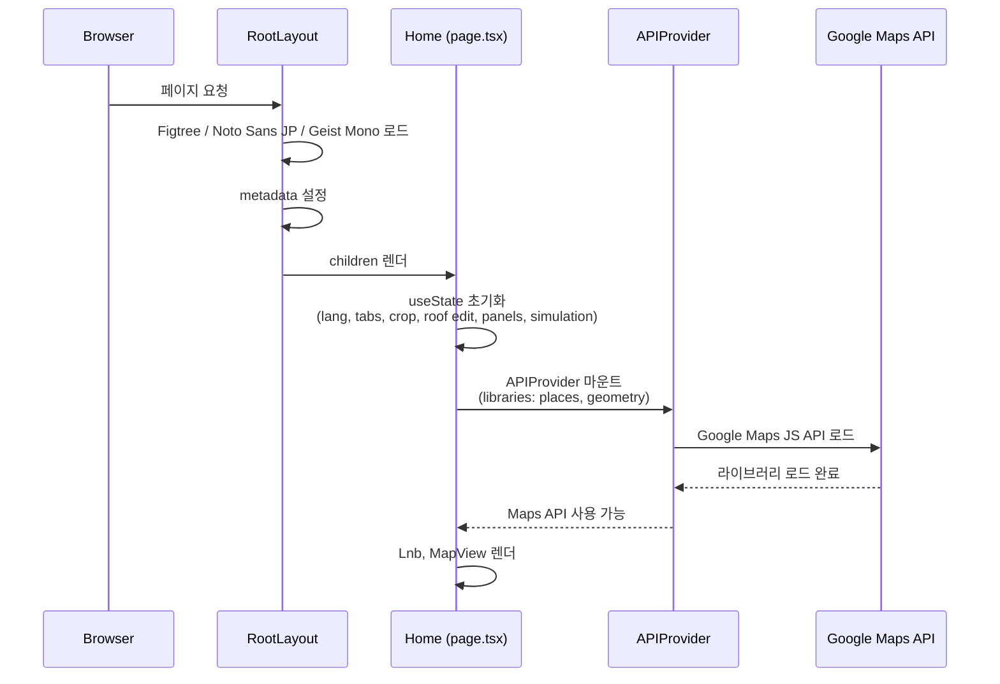
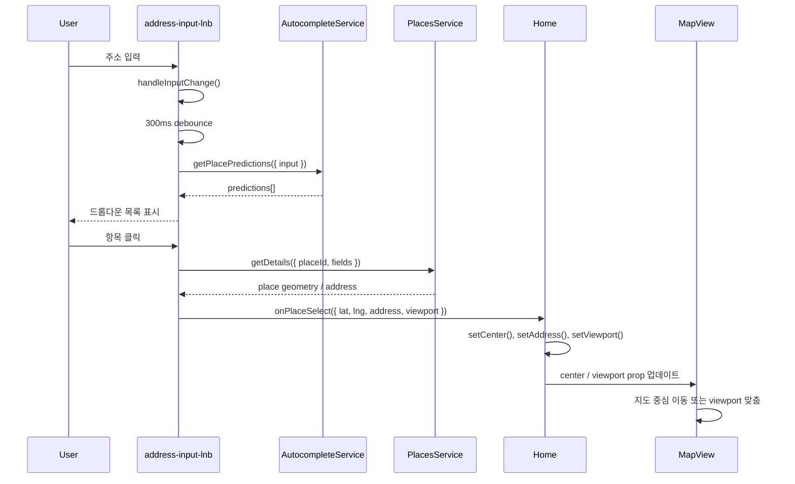
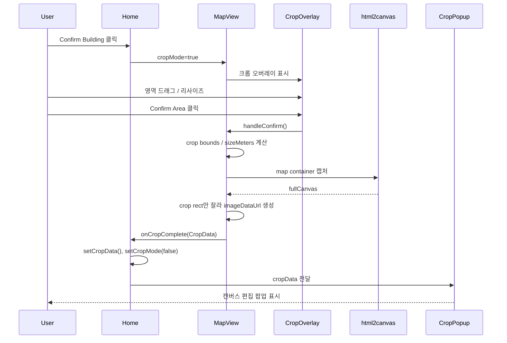
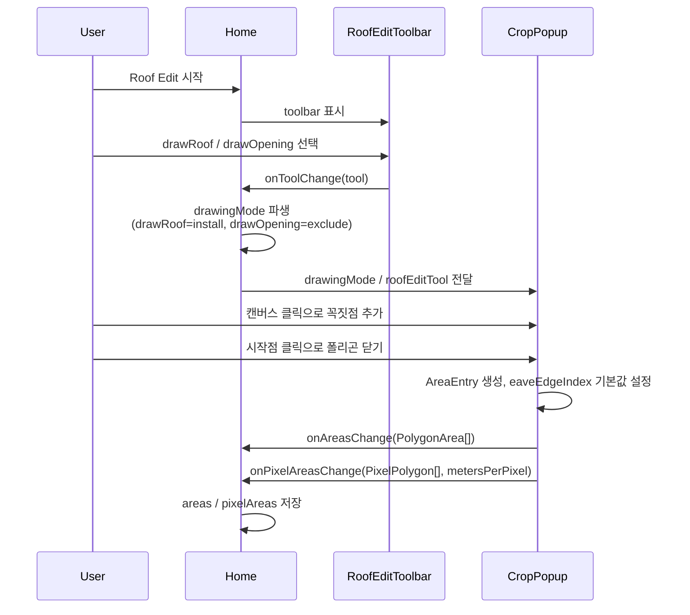
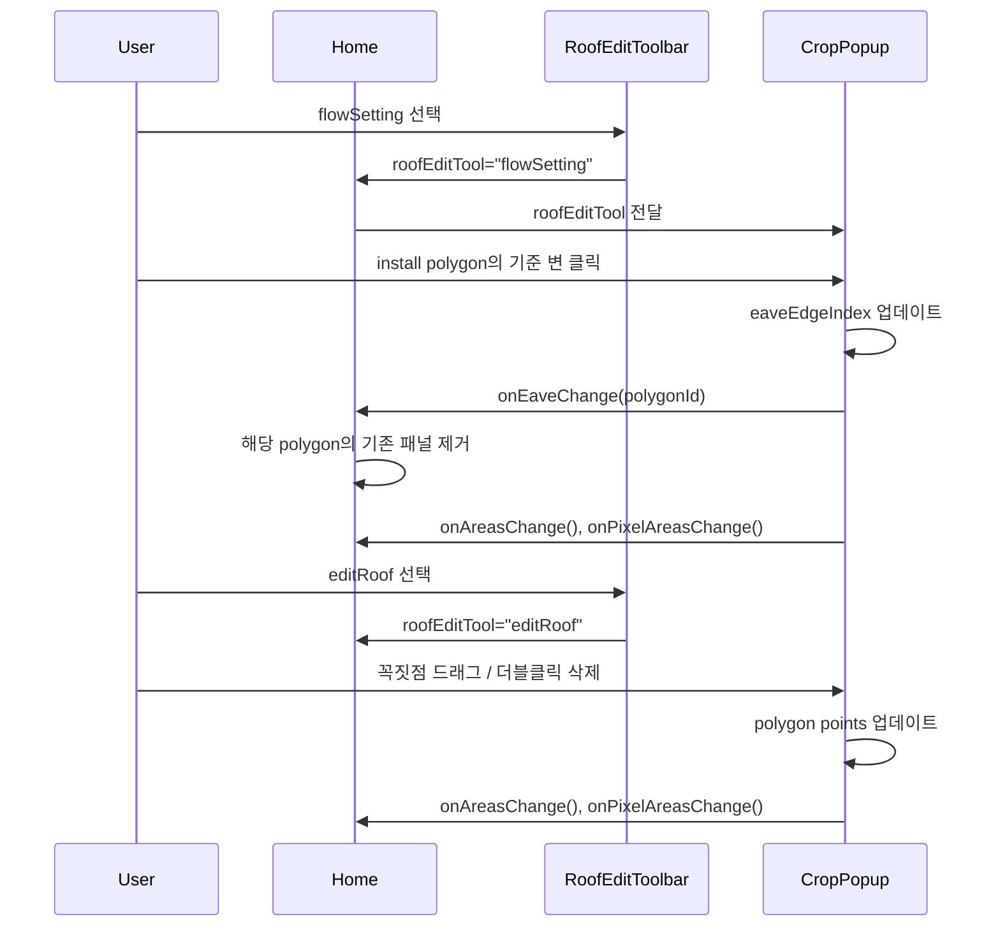
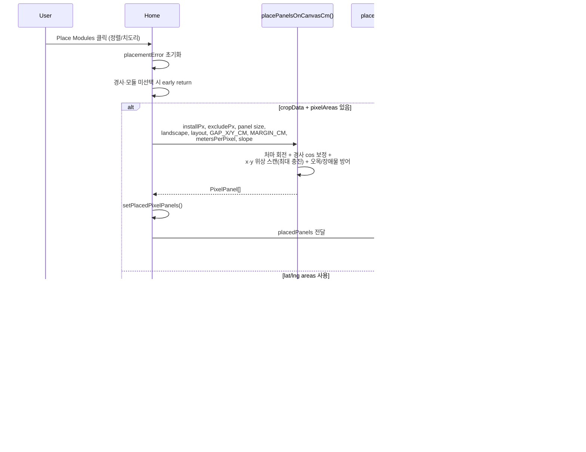
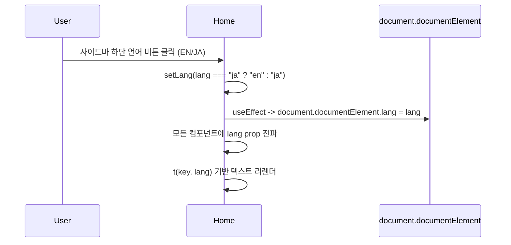

# Solar PV Planner - 시퀀스 다이어그램

## 1. 앱 초기화 시퀀스

```mermaid
sequenceDiagram
    participant B as Browser
    participant L as RootLayout
    participant H as Home (page.tsx)
    participant API as APIProvider
    participant GM as Google Maps API

    B->>L: 페이지 요청
    L->>L: Figtree / Noto Sans JP / Geist Mono 로드
    L->>L: metadata 설정
    L->>H: children 렌더
    H->>H: useState 초기화<br/>(lang, tabs, crop, roof edit, panels, simulation)
    H->>API: APIProvider 마운트<br/>(libraries: places, geometry)
    API->>GM: Google Maps JS API 로드
    GM-->>API: 라이브러리 로드 완료
    API-->>H: Maps API 사용 가능
    H->>H: Lnb, MapView 렌더
```

## 2. 주소 검색 시퀀스

```mermaid
sequenceDiagram
    participant U as User
    participant AS as address-input-lnb
    participant AC as AutocompleteService
    participant PS as PlacesService
    participant H as Home
    participant M as MapView

    U->>AS: 주소 입력
    AS->>AS: handleInputChange()
    AS->>AS: 300ms debounce
    AS->>AC: getPlacePredictions({ input })
    AC-->>AS: predictions[]
    AS-->>U: 드롭다운 목록 표시
    U->>AS: 항목 클릭
    AS->>PS: getDetails({ placeId, fields })
    PS-->>AS: place geometry / address
    AS->>H: onPlaceSelect({ lat, lng, address, viewport })
    H->>H: setCenter(), setAddress(), setViewport()
    H->>M: center / viewport prop 업데이트
    M->>M: 지도 중심 이동 또는 viewport 맞춤
```

## 3. 크롭 시퀀스

```mermaid
sequenceDiagram
    participant U as User
    participant H as Home
    participant M as MapView
    participant CO as CropOverlay
    participant C as html2canvas
    participant CP as CropPopup

    U->>H: Confirm Building 클릭
    H->>M: cropMode=true
    M->>CO: 크롭 오버레이 표시
    U->>CO: 영역 드래그 / 리사이즈
    U->>CO: Confirm Area 클릭
    CO->>M: handleConfirm()
    M->>M: crop bounds / sizeMeters 계산
    M->>C: map container 캡처
    C-->>M: fullCanvas
    M->>M: crop rect만 잘라 imageDataUrl 생성
    M->>H: onCropComplete(CropData)
    H->>H: setCropData(), setCropMode(false)
    H->>CP: cropData 전달
    CP-->>U: 캔버스 편집 팝업 표시
```

## 4. 캔버스 폴리곤 편집 시퀀스

```mermaid
sequenceDiagram
    participant U as User
    participant H as Home
    participant RT as RoofEditToolbar
    participant CP as CropPopup

    U->>H: Roof Edit 시작
    H->>RT: toolbar 표시
    U->>RT: drawRoof / drawOpening 선택
    RT->>H: onToolChange(tool)
    H->>H: drawingMode 파생<br/>(drawRoof=install, drawOpening=exclude)
    H->>CP: drawingMode / roofEditTool 전달
    U->>CP: 캔버스 클릭으로 꼭짓점 추가
    U->>CP: 시작점 클릭으로 폴리곤 닫기
    CP->>CP: AreaEntry 생성, eaveEdgeIndex 기본값 설정
    CP->>H: onAreasChange(PolygonArea[])
    CP->>H: onPixelAreasChange(PixelPolygon[], metersPerPixel)
    H->>H: areas / pixelAreas 저장
```

## 5. 처마 설정 및 편집 시퀀스

```mermaid
sequenceDiagram
    participant U as User
    participant H as Home
    participant RT as RoofEditToolbar
    participant CP as CropPopup

    U->>RT: flowSetting 선택
    RT->>H: roofEditTool="flowSetting"
    H->>CP: roofEditTool 전달
    U->>CP: install polygon의 기준 변 클릭
    CP->>CP: eaveEdgeIndex 업데이트
    CP->>H: onEaveChange(polygonId)
    H->>H: 해당 polygon의 기존 패널 제거
    CP->>H: onAreasChange(), onPixelAreasChange()

    U->>RT: editRoof 선택
    RT->>H: roofEditTool="editRoof"
    U->>CP: 꼭짓점 드래그 / 더블클릭 삭제
    CP->>CP: polygon points 업데이트
    CP->>H: onAreasChange(), onPixelAreasChange()
```

## 6. 패널 배치 계산 시퀀스

```mermaid
sequenceDiagram
    participant U as User
    participant H as Home
    participant PC as placePanelsOnCanvasCm()
    participant PL as placePanels()
    participant CP as CropPopup
    participant RP as LnbDesign

    U->>H: Place Modules 클릭 (정렬/치도리)
    H->>H: placementError 초기화
    H->>H: 경사·모듈 미선택 시 early return

    alt cropData + pixelAreas 있음
        H->>PC: installPx, excludePx, panel size,<br/>landscape, layout, GAP_X/Y_CM, MARGIN_CM,<br/>metersPerPixel, slope
        PC->>PC: 처마 회전 + 경사 cos 보정 +<br/>x·y 위상 스캔(최대 충진) + 오목/장애물 방어
        PC-->>H: PixelPanel[]
        H->>H: setPlacedPixelPanels()
        H->>CP: placedPanels 전달
        CP->>CP: canvas에 패널 오버레이 렌더
    else lat/lng areas 사용
        H->>PL: installAreas, excludeAreas,<br/>panelSize, landscape, layout, gapXMm, gapYMm,<br/>marginMm, slope
        PL-->>H: PlacedPanel[]
        H->>H: setPlacedPanelsList()
    end

    H->>RP: panelCount / panelSize / orientation 전달
    RP->>RP: 설치 용량, 면적, 커버리지 계산
```

## 7. i18n 언어 전환 시퀀스

```mermaid
sequenceDiagram
    participant U as User
    participant H as Home
    participant DOM as document.documentElement

    U->>H: 사이드바 하단 언어 버튼 클릭 (EN/JA)
    H->>H: setLang(lang === "ja" ? "en" : "ja")
    H->>DOM: useEffect -> document.documentElement.lang = lang
    H->>H: 모든 컴포넌트에 lang prop 전파
    H->>H: t(key, lang) 기반 텍스트 리렌더
```
